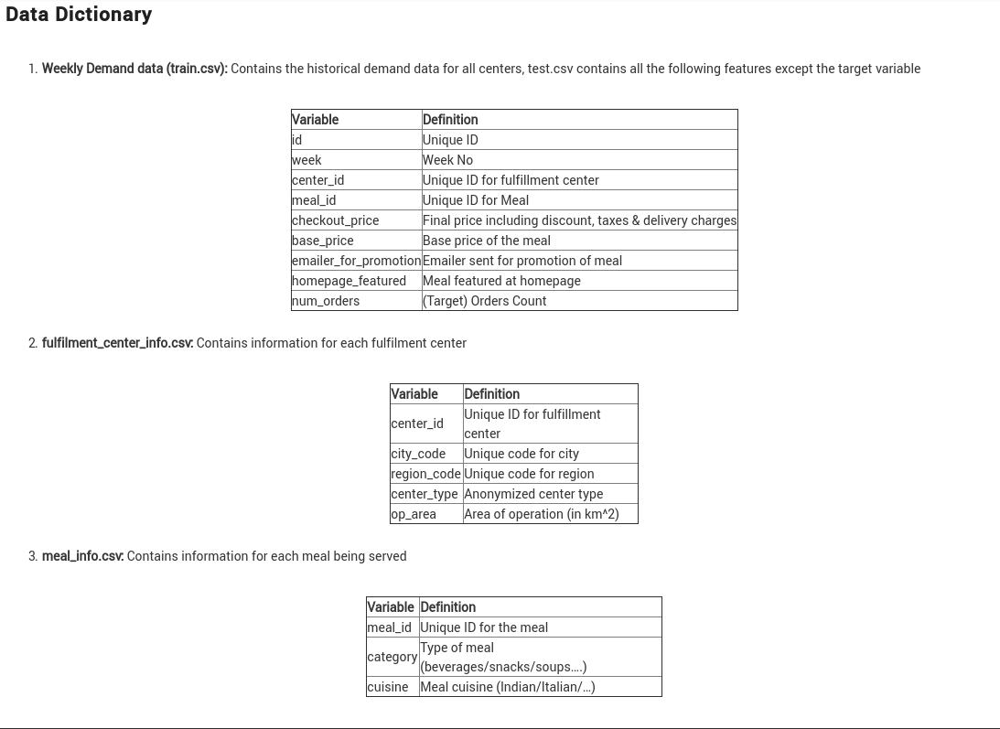

# Food-demand-forecasting-and-inventory-management
## Problem Statement
Demand forecasting is a key component to every growing online business. Without proper demand forecasting processes in place,it can be nearly impossible to have the right amount of stock on hand at any given time. A food delivery service has to dealwith a lot of perishable raw materials which makes it all the more important for such a company to accurately forecast daily and weekly demand.
Too much invertory in the warehouse means more risk of wastage,and not enough could lead to out-of-stocks - and push customers to seek solutions from your competitors. In this challenge, get a taste of demand forecasting challenge using a real datasets.

## About Our Project 
We have developed a Machine Learning  Model for
predicting the future demands for specific restaurents using previous weeks(0-145) datas
and we made inventory management for specific food industry
and we  added blockchain technology for tracing the 
food we made it.We used Flask framwork for developing web and Firebase for database.
### About the DataSet

1.Historical data of demand for a product-center combination(Weeks:1 to 145)

2.Product(Meal) features such as category,sub-category,current price and discount

3.Information for fulfillment center like center area, city information etc.

Dataset Collected from kaggle [link of dataset ](https://www.kaggle.com/datasets/kannanaikkal/food-demand-forecasting)

## Solution
We have made a  Machine Learning model by using GradientBoosting algorithm
which has accuracy of  about 93-95% for training data and 83% for testing data.

## Images of our Project
.png)
.png)
.png)
.png)
.png)

## How to run this project in your Machine:
    pip3 install  flask pyrebase numpy pickle 

### On terminal 1
     python app.py
### On terminal 2
      export FLASK_APP=block_chain.py
      flask run --port 8000

# Contributors
  1. SANJAI - Backend end and Machine Learning Part  [Github Link](https://github.com/sanjail3)
  2. Madumitha- Frontend HTML/CSS
